## 计算机毕业设计Hadoop+大模型高考推荐系统 高考分数线预测 知识图谱 高考数据分析可视化 高考大数据 大数据毕业设计 Hadoop 深度学习

## 要求
### 源码有偿！一套(论文 PPT 源码+sql脚本+教程)

### 
### 加好友前帮忙start一下，并备注github有偿大模型高考
### 我的QQ号是2827724252或者798059319或者 1679232425或者微信:bysj2023nb

# 

### 加qq好友说明（被部分 网友整得心力交瘁）：
    1.加好友务必按照格式备注
    2.避免浪费各自的时间！
    3.当“客服”不容易，repo 主是体面人，不爆粗，性格好，文明人。
	
## 介绍
当前这套升级代码属于超神吊打导师高配版(具备全部创新点！)，还有基础版、中配版、次高配版如下：
1-基础版(手动推荐)
2-中配版(协同过滤、无爬虫)
3-次高配版本(爬虫虽然有但是爬取数据不全-能力不够、情感分析、协同过滤用户+物品、无知识图谱无预测、功能不够显摆吊打)：
4-当前顶配最高版本介绍如下：
创新点：机器学习模拟志愿填报、4种机器学习深度学习推荐算法(协同过滤基于用户+物品、SVD神经网络、MLP模型)、Python爬取1000W数据量、lstm情感分析模型、KNN CNN GNN卷积神经网络预测算法、Spark+Hadoop大屏幕可视化、知识图谱、AI识别认证、短信接口、支付宝沙箱支付等100种创新点
开发技术：hadoop spark hive springboot vue.js mysql echarts websocket mybatis-plus element-ui 机器学习 深度学习 Python爬虫
注意点：现在是第四代大数据毕设，以前用协同过滤算法、做个大屏的、爬三两行数据的假大数据假算法假爬虫的代码答辩基本等着被导师狂怼！！！！现在的要求是全面装杯显摆吊打答辩现场，把世界上所有的创新点全部用一遍，无底线疯狂吊打摩擦导师！！！！

## 演示视频
https://www.bilibili.com/video/BV1E44y1c7XV

https://www.bilibili.com/video/BV1s8411U7rV/

## 截图
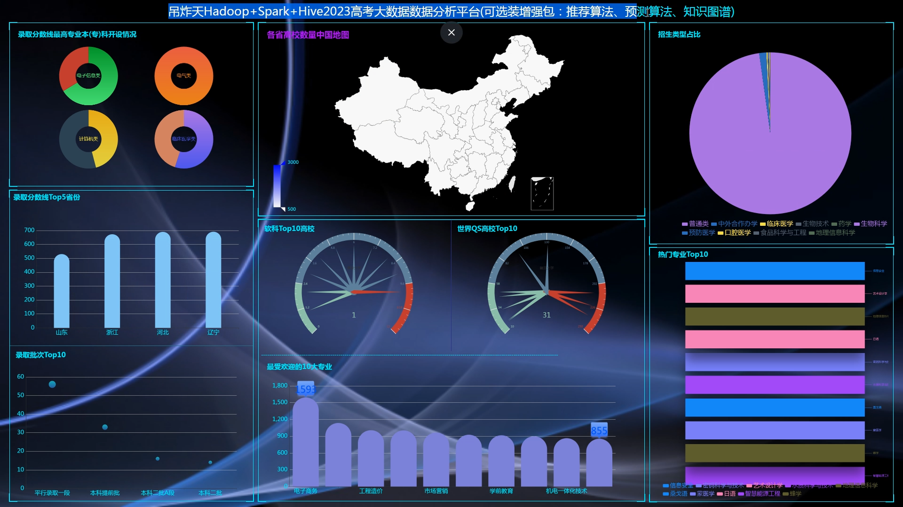

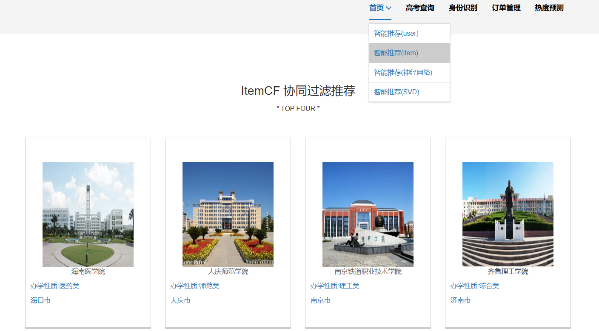

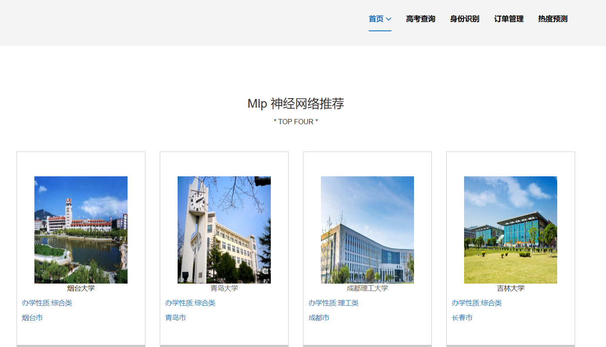
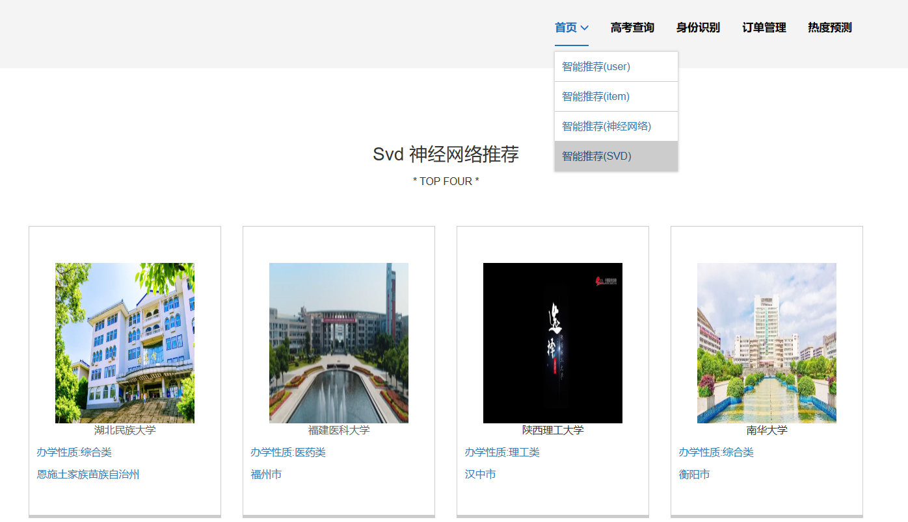
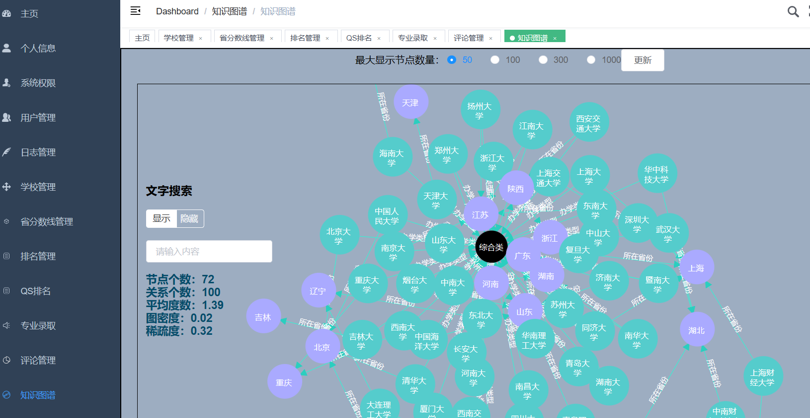
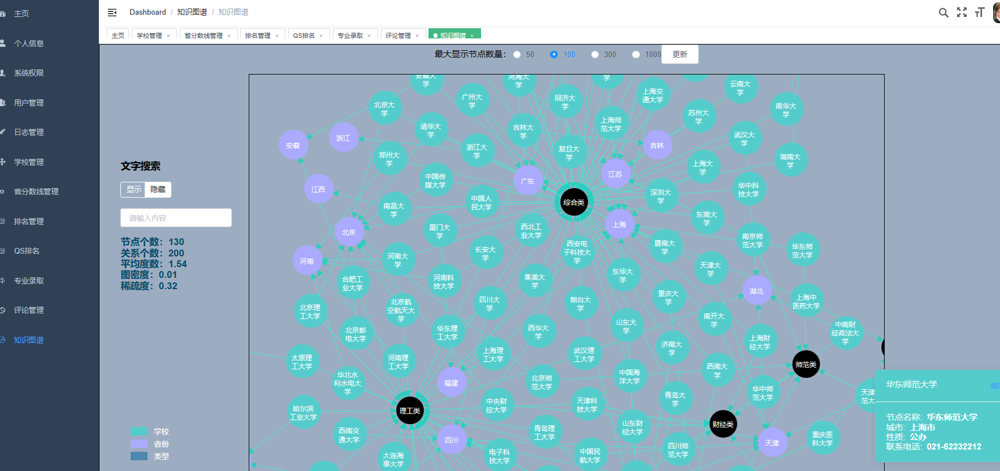
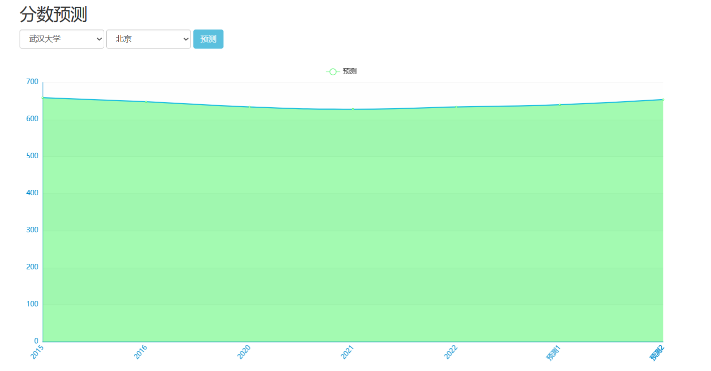
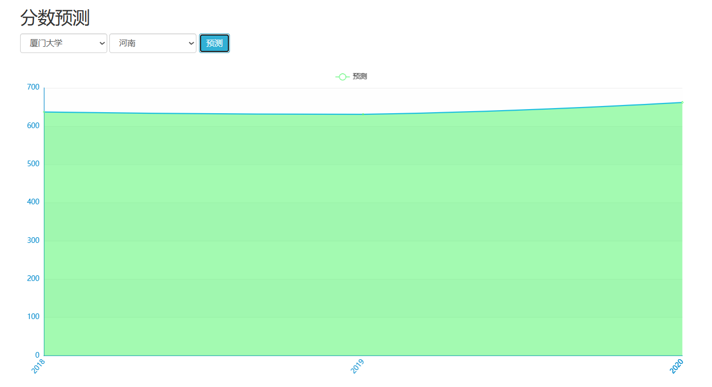
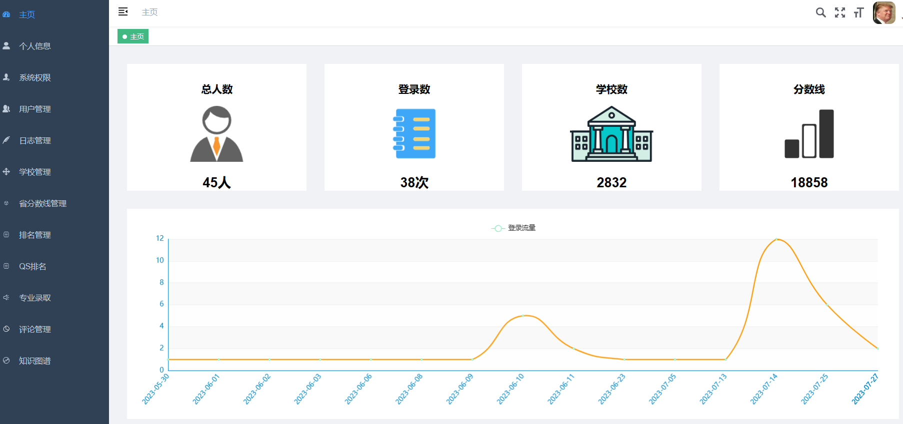
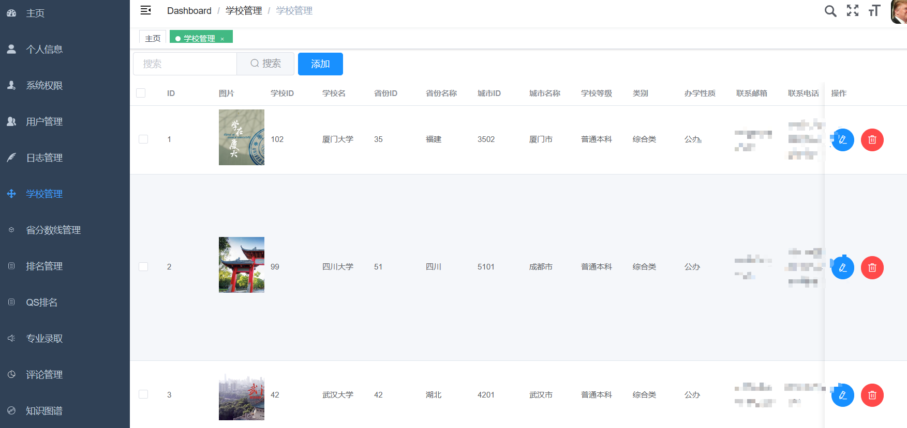
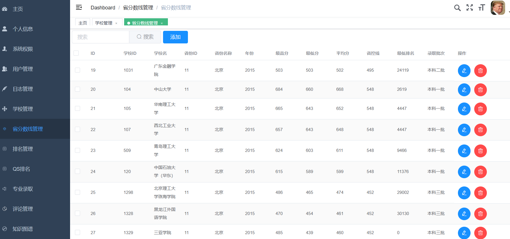
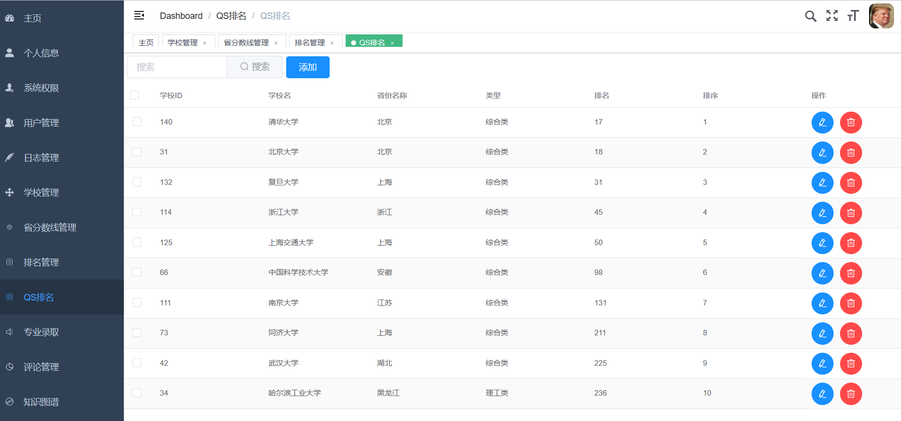
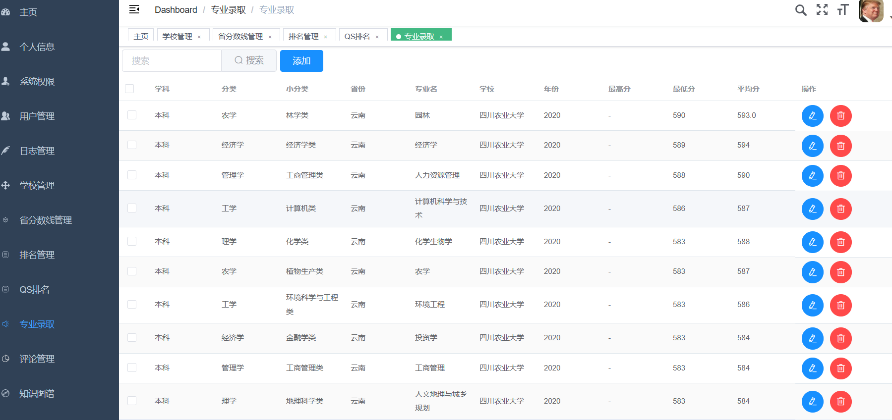
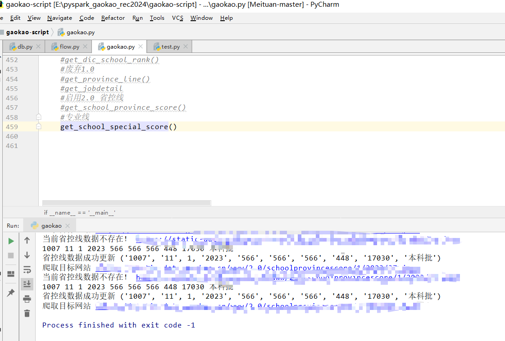
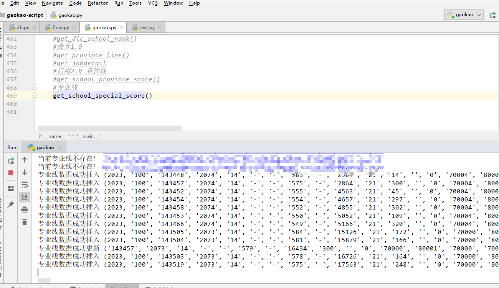
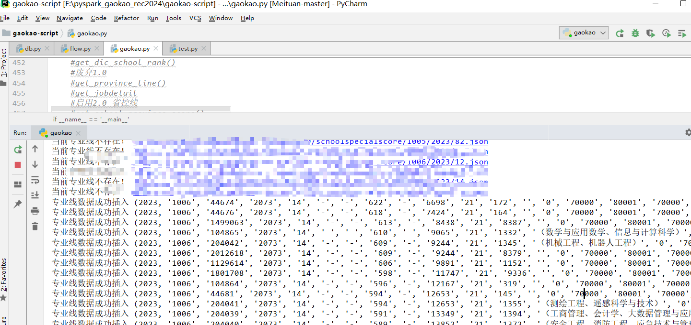

